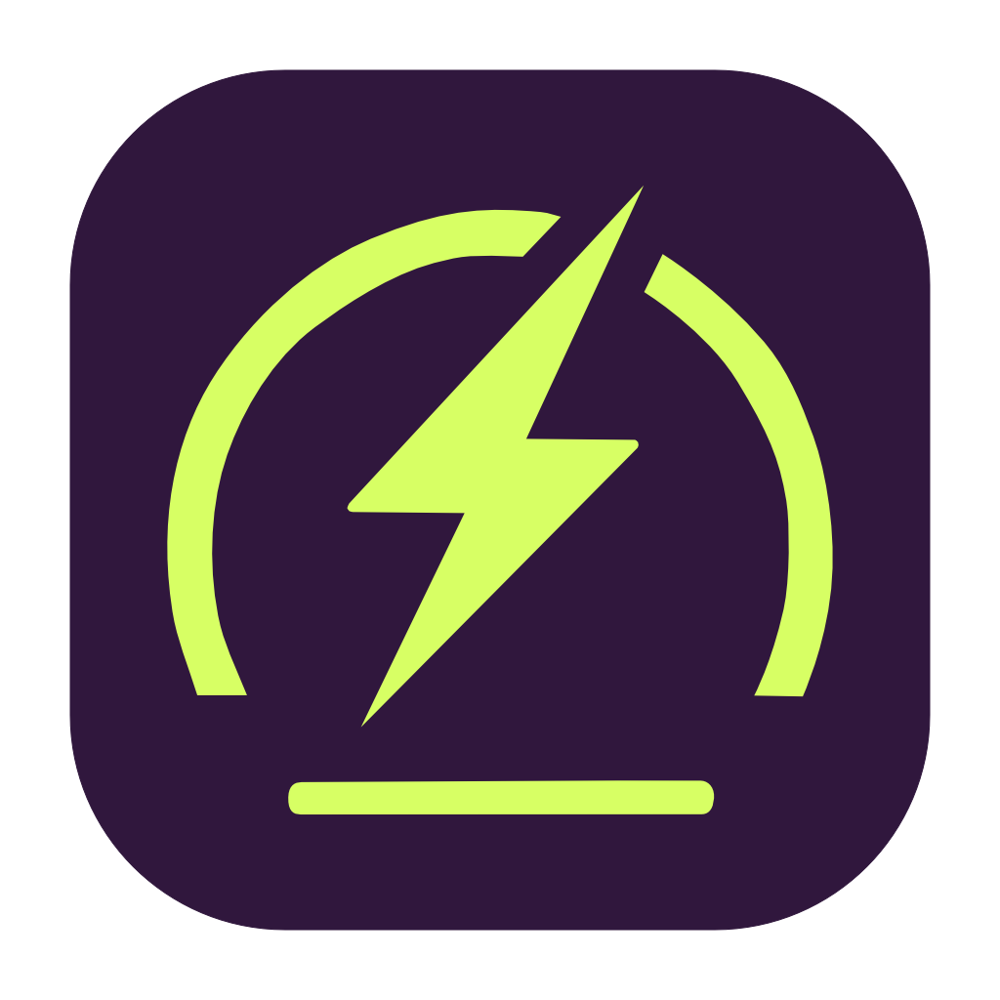
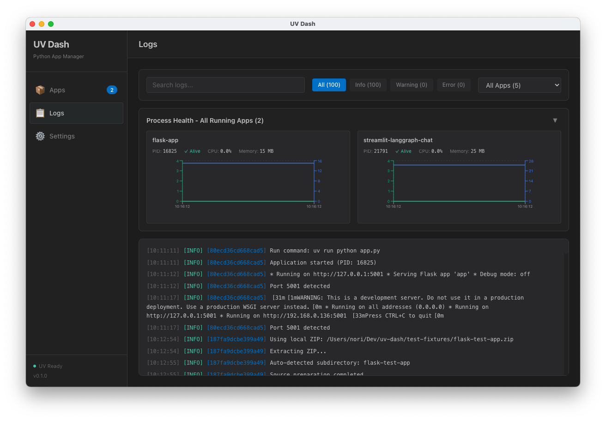

# UV Dash

  
  
<strong>uvベースのPythonアプリランチャー</strong>

  
  

  
<a href="README.md">English</a> | <a href="#ドキュメント">ドキュメント</a>

---

## 概要

UV Dashを使えば、コマンドライン操作なしでPythonアプリを簡単に実行・管理できます。[uv](https://github.com/astral-sh/uv)ベースのPythonアプリやシェルスクリプトのインストール・起動からモニタリング、環境変数・シークレットの管理まで、すべてGUIで完結します。

https://github.com/user-attachments/assets/59c36a02-6f8c-4e6d-9293-e436716d5001

### なぜUV Dashか？

- **コマンドライン不要** - 直感的なGUIで完結するPythonアプリ管理
- **幅広い互換性** - `uv run`/`uv x`で実行できるものなら何でも対応（Pythonアプリ、シェルスクリプトなど）。主要Webフレームワーク（Streamlit、FastAPI、Flask、Gradio、Django、FastMCP）はポート自動検出もサポート
- **本番環境対応** - モニタリング、ログ記録、安全なシークレット管理を内蔵

## 主な機能

- 🚀 **簡単インストール** - GitHub、ZIP、ローカルフォルダからドラッグ&ドロップでインストール
- ⚡ **ワンクリック起動** - ビジュアル表示でアプリを即座に起動・停止
- 📊 **リアルタイムモニタリング** - 各アプリのCPU・メモリ使用量をグラフで表示
- 📝 **統合ログビューア** - 見やすく色分けされたログ表示
- 🔐 **安全なシークレット管理** - APIキーや機密データを暗号化して保存
- 🌐 **Webアプリ対応** - ログからポートを自動検出し、Webインターフェースへのクイック起動ボタンを提供
- 🌍 **多言語対応** - 日本語と英語の完全サポート

## スクリーンショット

<table>
  <tr>
    <td width="50%">
      
      
<em>メイン画面</em>

    </td>
    <td width="50%">
      
      
<em>リアルタイムログビューア</em>

    </td>
  </tr>
  <tr>
    <td width="50%">
      
      
<em>GitHub/ZIP/Localからインストール</em>

    </td>
    <td width="50%">
      
      
<em>安全なシークレット管理</em>

    </td>
  </tr>
</table>

## クイックスタート

### インストール

お使いのプラットフォーム向けの最新版をダウンロード：

| プラットフォーム | ダウンロード |
|----------|----------|
| **macOS (Apple Silicon)** | [UV.Dash-arm64.dmg](https://github.com/hirune924/uv-dash/releases/latest/download/UV.Dash-0.2.0-arm64.dmg) |
| **macOS (Intel)** | [UV.Dash.dmg](https://github.com/hirune924/uv-dash/releases/latest/download/UV.Dash-0.2.0.dmg) |
| **Windows** | [UV.Dash.Setup.exe](https://github.com/hirune924/uv-dash/releases/latest/download/UV.Dash.Setup.0.2.0.exe) |
| **Linux** | [UV.Dash.AppImage](https://github.com/hirune924/uv-dash/releases/latest/download/UV.Dash-0.2.0.AppImage) |

**必要要件**: macOS 13以上 / Windows 10以上 / Ubuntu LTS

### 使い方

1. **UV Dashを起動** - アプリが`uv`のインストール状況を確認し、必要に応じてワンクリックインストールを提案
2. **アプリを追加** - 3つのソースから選択してインストール：
   - **GitHub**: リポジトリをクローン（ブランチ/タグ指定対応）
   - **ZIP**: ローカルまたはリモートのZIPアーカイブ
   - **ローカルフォルダ**: マシン上の既存プロジェクトを使用
3. **実行 & モニタリング** - ワンクリックでアプリを起動し、リアルタイムのCPU/メモリ使用量を監視
4. **ログ表示 & Web UI アクセス** - ライブログを確認し、🌐 ボタンでWebアプリケーションを開く
5. **シークレット管理** - アプリごとに環境変数と暗号化されたシークレットを設定

**高度な機能**:
- Pythonバージョンの設定（デフォルト: 3.13）
- あらゆる実行可能ファイルに対応するカスタム実行コマンド
- マルチプロセスアプリケーション対応

詳しい使い方は[ユーザーガイド](docs/user-guide.md)をご覧ください。

## ドキュメント

- **[ユーザーガイド](docs/user-guide.md)** - すべての機能の詳細な説明
- **[設定ガイド](docs/configuration.md)** - アプリ設定とフレームワーク対応
- **[高度な使い方](docs/advanced-usage.md)** - 複数プロセス、カスタムスクリプト、pre-hook
- **[ビルドガイド](docs/building.md)** - ソースからのビルドとクロスプラットフォームパッケージング
- **[コントリビューション](docs/contributing.md)** - 開発環境セットアップと貢献ガイドライン

## 対応しているPythonフレームワーク

UV Dashは以下のフレームワークを自動検出・サポート：

- **Streamlit** - データアプリケーションとダッシュボード
- **FastAPI / Uvicorn** - モダンなWeb API
- **Flask** - 伝統的なWebアプリケーション
- **Gradio** - 機械学習デモとインターフェース
- **Django** - フルスタックWebフレームワーク
- **FastMCP** - Model Context Protocolサーバー
- **カスタムCLIアプリ** - 実行コマンドを持つあらゆるPythonアプリケーション

## 技術スタック

- **フロントエンド**: React 19 + TypeScript + Tailwind CSS 4
- **デスクトップ**: Electron 38
- **Python**: uvパッケージマネージャー
- **セキュリティ**: Electron safeStorage API
- **国際化**: i18next + react-i18next

## ライセンス

MIT License - 詳細は[LICENSE](LICENSE)ファイルを参照してください。

## 貢献

コントリビューションを歓迎します！詳細は[コントリビューションガイド](docs/contributing.md)をご覧ください。

## サポート

- **Issues**: [GitHub Issues](https://github.com/hirune924/uv-dash/issues)
- **Discussions**: [GitHub Discussions](https://github.com/hirune924/uv-dash/discussions)

---

  Made with ❤️ by <a href="https://github.com/hirune924">hirune924</a>

