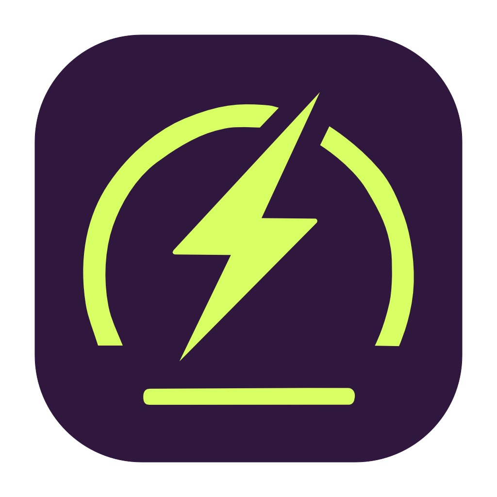
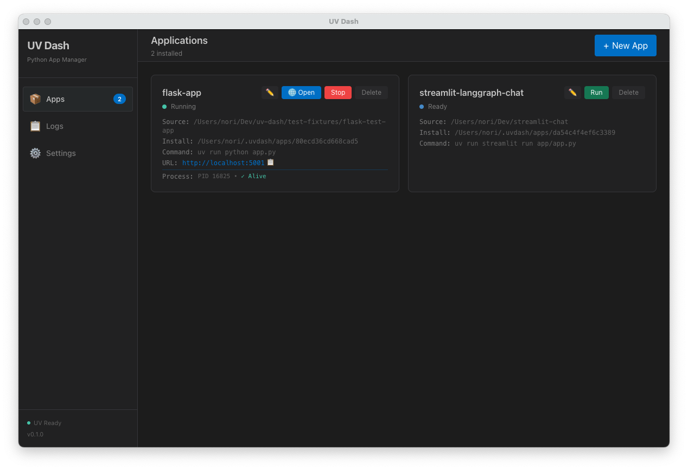
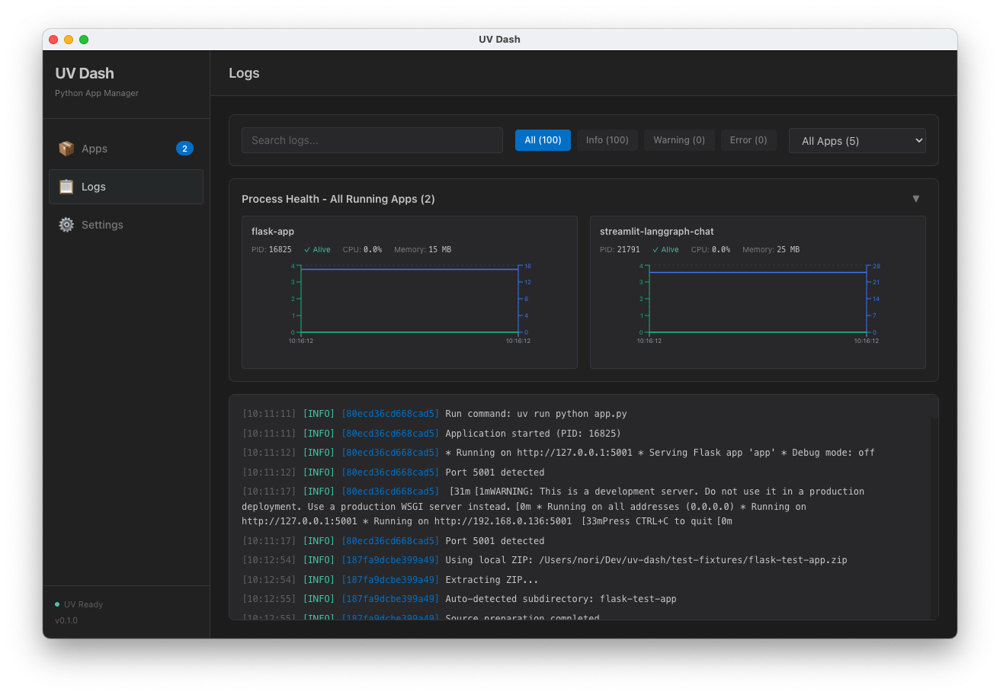
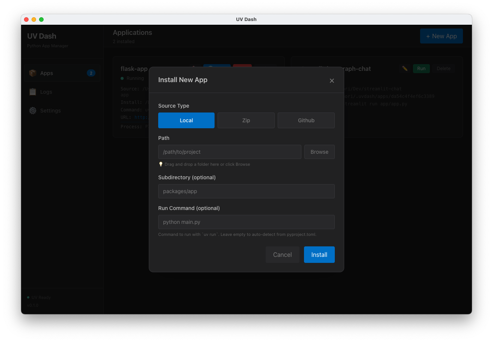
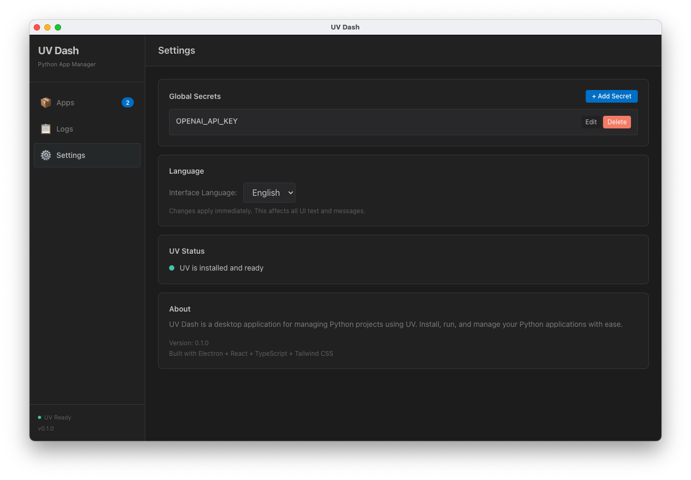

# UV Dash

  
  
<strong>Python application launcher powered by uv</strong>

  
  

  
<a href="README.ja.md">日本語</a> | <a href="#documentation">Documentation</a>

---

## Overview

UV Dash makes it easy to run and manage Python applications without using the command line. From installation and launch to monitoring and secrets management, everything is handled through the GUI for [uv](https://github.com/astral-sh/uv)-based Python apps and shell scripts.

https://github.com/user-attachments/assets/59c36a02-6f8c-4e6d-9293-e436716d5001

### Why UV Dash?

- **Zero Command Line** - Complete Python app management through an intuitive GUI
- **Universal Compatibility** - Run anything `uv run`/`uv x` can execute (Python apps, shell scripts, custom commands). Major web frameworks (Streamlit, FastAPI, Flask, Gradio, Django, FastMCP) include automatic port detection
- **Production Ready** - Built-in monitoring, logging, and secure secret management

## Key Features

- 🚀 **Easy Installation** - Install from GitHub, ZIP files, or local folders with drag & drop
- ⚡ **One-Click Launch** - Start and stop apps instantly with visual status indicators
- 📊 **Real-time Monitoring** - Live CPU and memory usage graphs for each application
- 📝 **Integrated Logs** - Color-coded log viewer for easy reading
- 🔐 **Secure Secrets** - Encrypted storage for API keys and sensitive data
- 🌐 **Web App Support** - Auto-detect ports from logs and provides quick launch button for web interfaces
- 🌍 **Multi-language** - Full English and Japanese interface support

## Screenshots

<table>
  <tr>
    <td width="50%">
      
      
<em>Main application view</em>

    </td>
    <td width="50%">
      
      
<em>Real-time log viewer</em>

    </td>
  </tr>
  <tr>
    <td width="50%">
      
      
<em>Install from GitHub/ZIP/Local</em>

    </td>
    <td width="50%">
      
      
<em>Secure secrets management</em>

    </td>
  </tr>
</table>

## Quick Start

### Installation

Download the latest version for your platform:

| Platform | Download |
|----------|----------|
| **macOS (Apple Silicon)** | [UV.Dash-arm64.dmg](https://github.com/hirune924/uv-dash/releases/latest/download/UV.Dash-0.2.0-arm64.dmg) |
| **macOS (Intel)** | [UV.Dash.dmg](https://github.com/hirune924/uv-dash/releases/latest/download/UV.Dash-0.2.0.dmg) |
| **Windows** | [UV.Dash.Setup.exe](https://github.com/hirune924/uv-dash/releases/latest/download/UV.Dash.Setup.0.2.0.exe) |
| **Linux** | [UV.Dash.AppImage](https://github.com/hirune924/uv-dash/releases/latest/download/UV.Dash-0.2.0.AppImage) |

**Requirements**: macOS 13+ / Windows 10+ / Ubuntu LTS

### Usage

1. **Launch UV Dash** - The app checks if `uv` is installed and offers one-click installation if needed
2. **Add Applications** - Install from three sources:
   - **GitHub**: Clone repositories (with branch/tag support)
   - **ZIP**: Local or remote ZIP archives
   - **Local Folder**: Use existing projects on your machine
3. **Run & Monitor** - Start apps with one click and monitor real-time CPU/memory usage
4. **View Logs & Access Web UIs** - Watch live logs and click the 🌐 button to open web applications
5. **Manage Secrets** - Configure environment variables and encrypted secrets per app

**Advanced Features**:
- Configure Python version (defaults to 3.13)
- Custom run commands for any executable
- Multi-process application support

That's it! For detailed instructions, see the [User Guide](docs/user-guide.md).

## Documentation

- **[User Guide](docs/user-guide.md)** - Complete walkthrough of all features
- **[Configuration Guide](docs/configuration.md)** - App configuration and framework support
- **[Advanced Usage](docs/advanced-usage.md)** - Multi-process apps, custom scripts, pre-hooks
- **[Building Guide](docs/building.md)** - Build from source and cross-platform packaging
- **[Contributing](docs/contributing.md)** - Development setup and contribution guidelines

## Supported Python Frameworks

UV Dash automatically detects and supports:

- **Streamlit** - Data applications and dashboards
- **FastAPI / Uvicorn** - Modern web APIs
- **Flask** - Traditional web applications
- **Gradio** - Machine learning demos and interfaces
- **Django** - Full-stack web framework
- **FastMCP** - Model Context Protocol servers
- **Custom CLI apps** - Any Python application with a run command

## Tech Stack

- **Frontend**: React 19 + TypeScript + Tailwind CSS 4
- **Desktop**: Electron 38
- **Python**: uv package manager
- **Security**: Electron safeStorage API
- **i18n**: i18next + react-i18next

## License

MIT License - See [LICENSE](LICENSE) file for details.

## Contributing

Contributions are welcome! Please see the [Contributing Guide](docs/contributing.md) for details.

## Support

- **Issues**: [GitHub Issues](https://github.com/hirune924/uv-dash/issues)
- **Discussions**: [GitHub Discussions](https://github.com/hirune924/uv-dash/discussions)

---

  Made with ❤️ by <a href="https://github.com/hirune924">hirune924</a>

