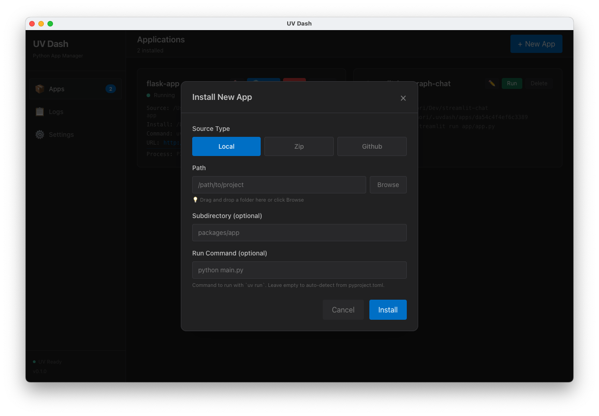
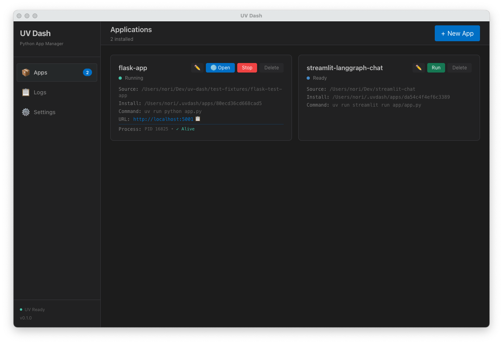
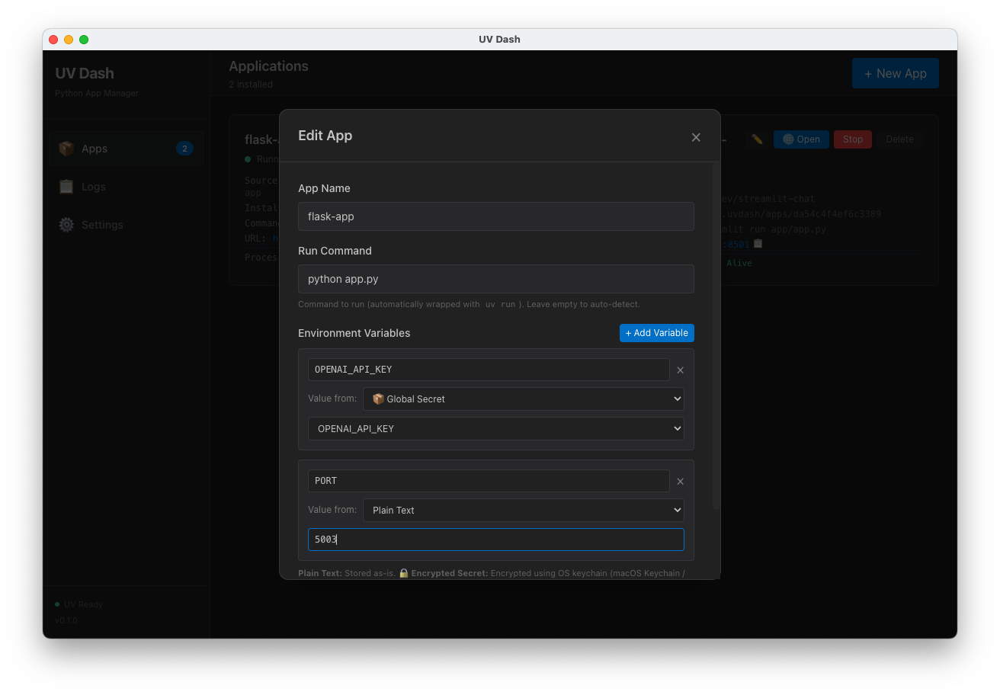

# User Guide

Complete guide to using UV Dash for managing and running Python applications.

## Table of Contents

- [Getting Started](#getting-started)
- [Installing Applications](#installing-applications)
- [Running and Managing Apps](#running-and-managing-apps)
- [Viewing Logs](#viewing-logs)
- [Monitoring Performance](#monitoring-performance)
- [Managing Secrets](#managing-secrets)
- [Settings and Configuration](#settings-and-configuration)
- [Troubleshooting](#troubleshooting)

## Getting Started

### First Launch

When you launch UV Dash for the first time:

1. **UV Installation Check**: The app automatically checks if `uv` is installed on your system
2. **Auto-Install Option**: If `uv` is not found, you'll see a prompt to install it with one click
3. **Ready to Use**: Once `uv` is installed, you can start adding applications

### System Requirements

- **Operating System**: macOS 13+, Windows 10+, or Ubuntu LTS
- **Disk Space**: 500MB minimum (plus space for your Python applications)
- **Memory**: 4GB RAM minimum, 8GB recommended
- **Internet**: Required for installing apps from GitHub or downloading ZIP files

## Installing Applications

UV Dash supports three installation methods: GitHub repositories, ZIP files, and local folders.

### Method 1: From GitHub Repository

Install Python applications directly from GitHub:

<div align="center">
  
  <p><em>Installation modal with GitHub source selected</em></p>
</div>

1. Click **"New App"** button in the top-right corner
2. The source type is **"local"** by default - click **"github"** button to switch
3. Enter the GitHub repository URL:
   ```
   https://github.com/username/repository
   ```
4. **(Optional)** Specify a branch, tag, or commit:
   - **Branch**: `main`, `develop`, etc.
   - **Tag**: `v1.0.0`, `release-2024`, etc.
   - **Commit**: Full commit hash
   - Leave empty to use the default branch
5. **(Optional)** Specify a subdirectory for monorepos:
   ```
   packages/app
   ```
6. **(Optional)** Set a custom run command (see [Configuration Guide](configuration.md))
7. Click **"Install"**

**Example:**
```
URL: https://github.com/streamlit/streamlit-example
Branch: main
Subdirectory: (leave empty)
Run Command: streamlit run streamlit_app.py
```

### Method 2: From ZIP File

Install from a ZIP archive (local file or URL):

1. Click **"New App"** button
2. Click **"zip"** button to select ZIP source type
3. **Option A - Local ZIP File**:
   - Drag and drop a ZIP file onto the modal
   - Or paste the full file path:
     ```
     /Users/username/Downloads/my-app.zip
     ```
4. **Option B - Remote ZIP File**:
   - Enter the URL to a ZIP file:
     ```
     https://example.com/releases/my-app-v1.0.zip
     ```
5. **(Optional)** Specify subdirectory if the ZIP contains a wrapper folder:
   ```
   my-app
   ```
   - UV Dash auto-detects single top-level directories
6. **(Optional)** Set run command
7. Click **"Install"**

**Auto-Detection**: If your ZIP file contains a single top-level directory (like `my-app/`), UV Dash will automatically use it as the subdirectory, so you don't need to specify it manually.

### Method 3: From Local Folder

Register a Python project already on your computer:

1. Click **"New App"** button
2. Source type **"local"** is selected by default
3. **Option A - Drag and Drop**:
   - Drag a folder from Finder/Explorer onto the modal
4. **Option B - Manual Path**:
   - Paste the full path to your project:
     ```
     /Users/username/projects/my-app
     ```
5. **(Optional)** Specify subdirectory if needed
6. **(Optional)** Set run command
7. Click **"Install"**

**Use Case**: Perfect for development - any changes to your local files are immediately reflected when you run the app.

### Installation Process

After clicking **"Install"**, UV Dash will:

1. **Download/Copy Source**: Get the application files
2. **Extract (if ZIP)**: Unzip and process the archive
3. **Read Configuration**: Check `pyproject.toml` for app metadata
4. **Create Virtual Environment**: Run `uv sync --python X.Y` to install dependencies with the configured Python version
5. **Mark as Ready**: App is now ready to run

<div align="center">
  
  <p><em>Installation progress with real-time logs</em></p>
</div>

You can monitor progress in real-time through the installation logs displayed in the modal.

### Installation Errors

If installation fails:

- **Check Logs**: The error message and logs are displayed in the installation modal
- **Common Issues**:
  - **Invalid URL/path**: Double-check the GitHub URL, ZIP URL, or file path
  - **Missing pyproject.toml**: The project must have a valid `pyproject.toml` file
  - **Network issues**: Check your internet connection for GitHub/ZIP URL installs
  - **Disk space**: Ensure you have enough space for dependencies
- **Retry**: Click **"Install"** again after fixing the issue

## Running and Managing Apps

### App List View

The main screen shows all your installed applications with:

<div align="center">
  
  <p><em>Main application view showing installed apps with status and monitoring</em></p>
</div>

- **App Name**: Extracted from `pyproject.toml` or derived from folder name
- **Status Indicator**:
  - **Not Installed** (gray): App needs installation
  - **Installing** (yellow): Installation in progress
  - **Ready** (green): Installed and ready to run
  - **Running** (blue): Currently executing
  - **Error** (red): Failed to start or encountered an error
- **Run Command**: The command that will be executed
- **Action Buttons**: Run, Stop, Edit, Delete
- **Performance Graphs**: Real-time CPU and memory usage (when running)

### Starting an Application

1. Find the app in the list
2. Click the **"Run"** button
3. The app status changes to **"Running"**
4. For web applications:
   - UV Dash automatically detects the port from logs
   - A browser icon (**🌐 Open**) button appears when ready
   - Click to open the app in your default browser

### Stopping an Application

1. Find the running app (status: **Running**)
2. Click the **"Stop"** button
3. The app gracefully shuts down
4. Status returns to **"Ready"**

### Editing App Settings

Click the **Edit** button (pencil icon) to modify:

- **App Name**: Change the display name
- **Run Command**: Update the command used to start the app
- **Environment Variables**: Add/edit app-specific environment variables (key-value pairs)

**Note**: Changes take effect the next time you run the app.

### Deleting an Application

1. Click the **Delete** button (trash icon)
2. Confirm the deletion in the dialog
3. The app and its virtual environment are completely removed

**Warning**: This action cannot be undone. The source files (if local) are not deleted, only the UV Dash installation.

## Viewing Logs

The **Logs** tab shows real-time output from your running applications.

<div align="center">
  
  <p><em>Real-time log viewer with stdout/stderr output</em></p>
</div>

### Features

- **Stdout/Stderr Display**: All console output from your app
- **Color-Coded Output**: Log levels and components are color-coded for easy reading
- **Auto-Scroll**: Automatically scrolls to show the latest logs
- **Per-App Logs**: Select different apps to view their specific logs

### Using Logs

1. Click the **"Logs"** tab at the top
2. Select an app from the dropdown (if multiple apps are running)
3. View real-time output as your app runs

### Debug Tips

- **Startup Issues**: Check the first few lines for import errors or missing dependencies
- **Runtime Errors**: Look for Python tracebacks and exception messages
- **Port Detection**: Watch for lines like `Running on http://0.0.0.0:8000`
- **Framework Messages**: Each framework has distinct startup messages (Streamlit, FastAPI, Flask, etc.)

## Monitoring Performance

UV Dash provides real-time performance monitoring for each running application.

### CPU and Memory Graphs

In the main **Apps** view, each running application displays:

- **CPU Usage**: Percentage of CPU resources used by the app process
- **Memory Usage**: RAM consumption in MB
- **Live Charts**: Real-time line graphs showing usage over time

### Understanding the Metrics

- **CPU %**: Shows the app's CPU usage relative to a single core
  - 100% = using one full CPU core
  - 200% = using two full CPU cores
- **Memory MB**: Physical RAM used by the app process
  - Includes Python interpreter and all loaded libraries
  - Does not include shared system libraries

### Performance Tips

- **High CPU**: Your app is doing intensive computation or has an infinite loop
- **High Memory**: Large datasets loaded or memory leak
- **Gradual Increase**: May indicate a memory leak - restart the app if it grows too large

## Managing Secrets

UV Dash provides three types of secure storage for API keys, passwords, and other sensitive data:

1. **Global Secrets**: Shared secrets that can be used across multiple applications
2. **App-Specific Encrypted Secrets**: Encrypted secrets stored per-application
3. **Plain Text Environment Variables**: Non-sensitive configuration variables

### Overview of Secret Types

| Type | Encryption | Scope | Use Case |
|------|-----------|-------|----------|
| **Global Secrets** | ✅ Yes | All apps | API keys shared across projects (e.g., OpenAI API key) |
| **Encrypted Secrets** | ✅ Yes | Single app | App-specific sensitive data (e.g., database password) |
| **Plain Text Env Vars** | ❌ No | Single app | Non-sensitive config (e.g., `DEBUG=true`) |

All encrypted secrets use Electron's `safeStorage` API with OS-level keychains (macOS Keychain, Windows Credential Manager, Linux Secret Service).

### Global Secrets

Global secrets are stored centrally and can be shared across multiple applications. Each app can reference the same secret using its own environment variable name.

<div align="center">
  
  <p><em>Settings view with Global Secrets management</em></p>
</div>

#### Adding a Global Secret

<div align="center">
  
  <p><em>Adding or editing a global secret</em></p>
</div>

1. Click the **"Settings"** tab
2. Scroll to **"Global Secrets"** section
3. Click **"+ Add Secret"**
4. Enter:
   - **Name**: A descriptive name (e.g., `OpenAI API Key`)
   - **Value**: The secret value (e.g., `sk-...`)
   - **Description (optional)**: Additional notes about the secret
5. Click **"Create"**

#### Using Global Secrets in Apps

After creating a global secret, you can reference it in any application:

<div align="center">
  
  <p><em>App-specific environment variables with secret type selection</em></p>
</div>

1. Click the **Edit** button on an app
2. Scroll to **"Environment Variables"** section
3. Click **"+ Add Variable"**
4. Enter the environment variable name (e.g., `OPENAI_API_KEY`)
5. Select **"📦 Global Secret"** from the dropdown
6. Choose the global secret from the list (e.g., `OpenAI API Key`)
7. Click **"Save"**

**Example**: You can use the same "OpenAI API Key" global secret in multiple apps:
- App A: `OPENAI_API_KEY` → OpenAI API Key
- App B: `API_KEY` → OpenAI API Key
- App C: `OPENAI_SECRET` → OpenAI API Key

Each app accesses it with its own environment variable name.

#### Editing/Deleting Global Secrets

- **Edit**: Click the **Edit** button next to a secret
  - You can update the **Name**, **Value**, or **Description**
  - Leave the **Value** field empty to keep the current encrypted value
- **Delete**: Click the **Delete** button
  - You'll see a warning if any apps are using this secret
  - Deleting removes the secret from all apps using it

### App-Specific Encrypted Secrets

For sensitive data that's only used by one application, use encrypted secrets:

1. Click the **Edit** button on an app
2. Scroll to **"Environment Variables"** section
3. Click **"+ Add Variable"**
4. Enter the environment variable name (e.g., `DATABASE_PASSWORD`)
5. Select **"🔒 Encrypted Secret"** from the dropdown
6. Enter the secret value
7. Click **"Save"**

**Key Differences from Global Secrets**:
- Stored **per-application** (not shared)
- No need to create a separate global secret first
- Encrypted using the same OS keychain mechanism
- Cannot be reused by other applications

### Plain Text Environment Variables

For non-sensitive configuration:

1. Click the **Edit** button on an app
2. Scroll to **"Environment Variables"** section
3. Click **"+ Add Variable"**
4. Enter the environment variable name (e.g., `DEBUG`)
5. Select **"Plain Text"** from the dropdown (default)
6. Enter the value (e.g., `true`)
7. Click **"Save"**

**Use for**:
- Debug flags
- Log levels
- Feature toggles
- Port numbers
- Any non-sensitive configuration

### Security Notes

- **Never Logged**: Secret values never appear in logs or error messages
- **OS-Level Encryption**: All encrypted secrets use system keychains
- **Access Control**: Secrets are only accessible while UV Dash is running
- **No Plain Text Files**: Encrypted secrets are never written to disk unencrypted

## Settings and Configuration

### Language Selection

UV Dash supports English and Japanese:

1. Go to **"Settings"** tab
2. Click **"Language"** dropdown
3. Select **English** or **日本語**
4. The interface updates immediately

### UV Management

In the **Settings** tab, you can manage your UV installation:

- **Check Status**: The "UV Status" section shows if `uv` is installed and ready
- **Install UV**: If not installed, click the **"Install UV"** button
  - UV Dash will automatically download and install UV for you
  - If automatic installation fails, you'll see instructions for manual installation
- **Update UV**: Keep UV up to date with the latest features and bug fixes
  - Go to **Settings** → **Advanced Settings** → **Update UV**
  - Click the **"Update UV"** button
  - UV Dash runs `uv self update` to upgrade to the latest version
  - The update process takes a few seconds

### Advanced Settings

Advanced Settings are accessible in the **Settings** tab by expanding the "Advanced Settings" section.

#### Cleanup Orphaned Directories

Over time, failed installations or interrupted operations can leave behind unused directories. Use this feature to clean them up:

1. Go to **Settings** → **Advanced Settings**
2. Expand **"Cleanup Orphaned Directories"**
3. Click **"Cleanup Now"**
4. Confirm the cleanup action
5. UV Dash will remove all directories in the apps folder that are not registered in your app list

**When to use**:
- After multiple failed installation attempts
- When you notice high disk usage in the UV Dash directory
- As periodic maintenance (e.g., monthly)

**Safe operation**: Only directories not associated with any registered app are deleted. Your active applications are never affected.

#### Apps Installation Directory

By default, UV Dash installs applications in your home directory (`~/.uvdash/apps/`). You can change this location:

1. Go to **Settings** → **Advanced Settings**
2. Expand **"Apps Installation Directory"**
3. View the current directory path
4. **Option A - Browse**: Click **"Browse"** to select a new directory
5. **Option B - Manual**: Enter the full path directly
6. Click **"Save"** to apply the change

**Important notes**:
- Changing the directory does **not** move existing applications
- New installations will use the new directory
- Ensure the new directory has sufficient disk space
- The path must be writable by UV Dash

**Use cases**:
- Moving installations to a drive with more space
- Organizing applications in a specific location
- Storing apps on a faster SSD

#### Update UV

Keep UV up to date with the latest features and bug fixes:

1. Go to **Settings** → **Advanced Settings**
2. Expand **"Update UV"**
3. Click **"Update UV"**
4. Wait for the update to complete (usually 5-10 seconds)
5. A success message confirms the update

**What happens**:
- UV Dash runs `uv self update` with `UV_NO_MODIFY_PATH=1`
- UV is updated to the latest stable version
- Your existing applications and settings are not affected
- No restart required

**Recommendation**: Update UV every few weeks to get the latest improvements.

#### Default Python Version

Control which Python version is used for all applications by default:

1. Go to **Settings** → **Advanced Settings**
2. Expand **"Default Python Version"**
3. Select a Python version from the dropdown (e.g., 3.13, 3.12, 3.11)
4. Click **"Set as Default"**
5. Wait for the installation to complete

**What happens**:
- UV Dash runs `uv python install X.Y --default`
- The selected version is downloaded and set as the default for UV
- All new application installations will use this Python version with `uv sync --python X.Y`
- Existing applications are not affected until they are reinstalled

**Default behavior**:
- If no version is selected, Python 3.13 is used by default
- This ensures compatibility with most modern Python projects

**Use cases**:
- Testing applications with specific Python versions
- Avoiding compatibility issues with newer Python releases
- Matching your development environment's Python version

### Data Storage

UV Dash stores data in your home directory:

- **macOS**: `~/Library/Application Support/uv-dash/`
- **Windows**: `%APPDATA%\uv-dash\`
- **Linux**: `~/.config/uv-dash/`

**Stored Data**:
- App metadata and settings
- Encrypted secrets
- Application logs
- Virtual environments (in `~/.uvdash/apps/`)

## Troubleshooting

### App Won't Start

**Problem**: Clicking "Run" results in "Error" status

**Solutions**:
1. Check the **Logs** tab for error messages
2. Verify the **run command** is correct in Edit settings
3. Ensure all dependencies installed correctly (check install logs)
4. Try deleting and reinstalling the app

### Port Already in Use

**Problem**: Error message "Address already in use"

**Solutions**:
1. Stop other apps using the same port
2. Change the port in your app's configuration
3. Use port 0 for auto-assignment (if supported by framework)

### Can't Open Web App

**Problem**: Browser button doesn't appear or URL doesn't work

**Solutions**:
1. Check logs - look for lines with `http://` or `https://`
2. Verify the framework is actually starting a web server
3. Manually enter the URL from logs into your browser
4. Try `http://localhost:<port>` if `0.0.0.0` doesn't work

### Installation Takes Too Long

**Problem**: Installation seems stuck

**Solutions**:
1. Check logs for progress - large dependencies take time
2. Ensure stable internet connection
3. Wait at least 5-10 minutes for complex apps
4. If truly stuck (no log updates for 10+ minutes), close and retry

### Secrets Not Working

**Problem**: App can't access environment variables

**Solutions**:
1. Verify the secret **key name** matches what your app expects
2. Check that your app reads from environment variables (e.g., `os.getenv("KEY")`)
3. Restart the app after adding secrets
4. For app-specific config, use the app's Edit → Environment Variables section

### App Crashes Frequently

**Problem**: App runs but stops unexpectedly

**Solutions**:
1. Check logs for Python errors or exceptions
2. Verify all required environment variables are set
3. Test the app manually in terminal to isolate UV Dash from app bugs
4. Monitor memory usage - may be running out of RAM

### Need More Help?

- **GitHub Issues**: [Report bugs or ask questions](https://github.com/hirune924/uv-dash/issues)
- **Discussions**: [Community support](https://github.com/hirune924/uv-dash/discussions)
- **Documentation**: See [Configuration Guide](configuration.md) and [Advanced Usage](advanced-usage.md)

---

[← Back to README](../README.md) | [Configuration Guide →](configuration.md)
